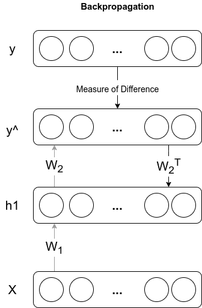
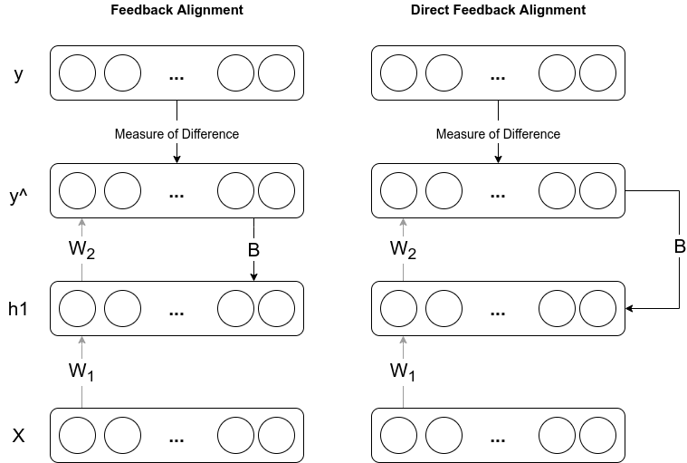

---
#########################################
# options for knitting a single chapter #
#########################################
output:
  bookdown::pdf_document2:
    template: templates/brief_template.tex
    citation_package: biblatex
  bookdown::html_document2: default
  bookdown::word_document2: default
documentclass: book
bibliography: [bibliography/references.bib, bibliography/additional-references.bib]
---

# Theoretical Foundations {#chap:chapter_1}

\minitoc <!-- this will include a mini table of contents-->

## Backpropagation
BP is one of the first algorithms that show ANNs could learn hidden representations well. Numerous studies showed that ANNs trained with BP could capture similar information as biological neural networks (e.g., specific nodes learn the edges, corners). We need three components for BP, a dataset composed of input-output pairs, a network consisting of parameters (weights and biases), and it allows the input to flow through the network to have output. We need a loss function to measure the difference between the output of the network and the ground truth that we have from the dataset.\
The main goal of BP is computing the gradients of the loss function (a measure of difference) concerning the parameters of neural networks by using the chain rule. These gradients show how much the parameter needs to change (positively or negatively) to minimize the loss function. After efficiently calculating the gradients, we can adjust the network parameters using gradient descent or its variants.
$$
\begin{aligned} 
\text{parameter} &= \text{parameter} - \text{step size} \times \frac{\partial BCE}{\partial \text(parameter)}  \\
\end{aligned}
$$
\noindent Although BP is an older idea, it earned popularity with \cite{Rumelhart:1986we} because it presented how BP can make a network to learn the representations. After this popularity, the community published numerous practical and theoretical papers that investigated the dynamics of BP. It would be repeat and infeasible to show all the aspects again. However, for completeness and a smoother transition from BP to DFA, it is beneficial to have visual and mathematical explanations showing how the algorithms propagate the errors and the weights. For the mathematical foundations, a binary classification task is demonstrated with binary cross-entropy (BCE) loss as an example in appendix \ref{chap:appendix_a}. This example is not chosen arbitrarily. Indeed the parity problem that MNIST imitates and random data classification problem are binary classification problems. In addition to this, equations from appendix \ref{chap:appendix_a} are used to implement BP from scratch to have more control over the process. Then the exact implementation is modified to obtain DFA. The same set of steps are valid for different loss functions and activation functions. Only the calculations will be slightly different. The general idea is the same: obtaining the gradients by calculating the derivative of the loss function concerning the parameters.
```{r BP-Error, fig.cap="Error Transportation in BP", fig.align='center', out.width='30%', echo=FALSE}

```
\noindent In figure \ref{fig:BP-Error} we have a simple network with only a hidden layer that shows the error transportation configuration in BP. $W_i$ are the weights, $h_i$ are the output of the hidden layers that is denoted as $i$, $\hat{y}$ is the output of the network, and $y$ is the ground truth, for the sake of simplicity, biases are not showed in this figure. It is important to note that in BP, the transpose of weight is propagated to calculate the gradients. In literature, this issue is known as the weight transport problem, and it is one of the most criticized disadvantages of BP.

### Drawbacks of BP

We know that biological neurons inspired ANNs. However, recent studies showed that BP is not precisely how biological neurons learn \cite{bengio2016biologically}. That is why the community proposed many alternative algorithms by addressing these limitations of BP. This brings a term called biological plausibility of an algorithm that indicates the algorithm's consistency with existing biological, medical, and neuroscientific knowledge. In the light of this term, we can put in order the drawbacks of BP as the following:
\begin{itemize}
    \item \textbf{Biological implausibility:}
    \begin{itemize}
        \item The BP computation is purely linear whereas biological neurons interleave linear and non-linear operations.
        \item BP needs precise knowledge of derivatives of the non-linearities at the operating point used in the corresponding feedforward computation on the feedforward path.
        \item BP has to use exact symmetric weights of the feedforward connections.
        \item Real neurons communicate by binary values (spikes), not by clean continuous values.
        \item The computation has to be precisely clocked to alternate between feedforward and BP phases.
        \item It is not clear where the output targets would come from.
        \cite{bengio2016biologically, lee2015difference} 
    \end{itemize}  
    \item \textbf{Vanishing or Exploding Gradients}
    \item \textbf{Lack of Parallel Processing} \cite{ma2019hsic}
\end{itemize}

\noindent Simple interventions may handle some of these drawbacks. For instance, implementing gradient clipping or different activation functions might solve exploding gradients and vanishing gradients. However, they may frequently happen in deeper networks, and they must be considered while training ANNs. On the other hand, some of the drawbacks can not be handled with superficial modifications. For instance, BP is a sequential process, and there are locking mechanisms (forward, backward, and update) that ensure none of the processes is executed before its preceding completion. This makes BP infeasible for parallel processing because each execution has to wait for its preceding process. Hence deeper and larger networks' training can be computationally expensive. \
Biological plausibility is significant because of a couple of reasons. We know that biological neurons inspired ANNs, and biological plausibility refers to consistency between BP and biological knowledge about the neurons of a brain. Hence, it is interesting to examine the dissimilarity or similarity among them. Besides, there is a field that is the intersection of neuroscience and deep learning, so it is natural to investigate the biological plausibility feature of the algorithms, especially for this field. Furthermore, even though nowadays ANNs might outperform the human brain in a specific task, we are still distant from fully mimicking it. In other words, most of the time, ANNs are very good on a task that they are trained in, but they are not diverse, and some kinds of attacks like adversarial ones can easily trick them. Investigating the learning dynamics of these algorithms may open the doors of diverse ANNs that are not specialized in a single task or make them more robust to attacks. \
Alternative algorithms address some of the drawbacks of BP, and they propose a solution to them, but they also demonstrate a couple of them. However, these algorithms can be considered one or more steps closer to more biologically plausible and robust algorithms.

## Direct Feedback Alignment
So far, we have seen the error is propagated in BP sequentially through a network with the backward pass. Unlike BP, DFA uses a different way to propagate the error. This way uses a random matrix instead of the transpose of the weight matrix, which brings a solution to the weight transport problem. Before explaining how DFA works, it is better to investigate the feedback alignment (FA) algorithm since DFA is the extension of FA. \
In \cite{lillicrap2014random}, authors proved that precise symmetric weights are not required to obtain learning in ANNs. Without these matrices, BP-like learning can be obtained. Any random matrix under some conditions can provide the learning. Implicit dynamics in the standard forward weight updates encourage an alignment between weights and the random matrix. In other words, a random matrix pushes the network in roughly the same direction as BP would. They supported this hypothesis with some experiments on a linear problem and MNIST classification task. The empirical results demonstrate that FA successfully trains the network and has similar performance results as BP on these tasks. \
Even though learning still occurs with random matrix and FA offers the solution to the weight transport problem, it does not provide any computational advantage. To extend DFA, we need to change the error propagation mechanism of FA slightly. In FA, the error is propagated through a random matrix, but the backward process is still sequential. DFA extends this idea and propagates the random matrix in parallel to each layer. In other words, DFA takes the loss and distribute it globally to all layers without requiring sequential step. It also creates an opportunity to parallelize the computation that might speed up the training process.
```{r DFA-Error, fig.cap="Error Transportation in DFA", fig.align='center', out.width='65%', echo=FALSE}

```
\noindent In figure \ref{fig:DFA-Error} we can see the error transportation configurations for FA and DFA. This figure is the same as the one in \cite{nøkland2016direct} but shows only one hidden layer. In fact, with only one hidden layer, FA and DFA are identical. \
It is crucial to point out, BP and DFA have different learning dynamics. BP calculates the gradients that point to the steepest descent in the loss function space. On the other hand, FA and DFA provide a different update direction but still descending. It is still descending because empirical and theoretical results proved that the networks' weights align with the random matrix that leads to gradients alignment. Therefore the more alignment we have, the same direction would FA and DFA point as BP. Even though they have different update directions, since they are both descending, the results from \cite{lillicrap2014random, nøkland2016direct} showed that FA and DFA are as good as BP in terms of performance for specified tasks in these papers. In addition to this, ANNs trained with DFA show decent separation for labels as in BP's hidden representations of the layers.\
Recently, a new study has been published which tests the applicability of DFA on modern deep learning tasks and architectures such as neural view synthesis, recommender systems, geometric learning, and natural language processing \cite{launay2020direct}. Because even though some of the alternative methods are competitive with BP in simple tasks like MNIST, they are not competitive or trainable on more complex tasks. Results showed that DFA successfully trains all these complex architectures with performance close to BP. This study supports that complex tasks can be solved without symmetric weight transport, proving that DFA is suitable for more challenging problems. \
Let us use the same example as \ref{chap:appendix_a} to present how gradients are calculated in DFA. After having the mathematical foundations of BP, transition to DFA is relatively easy. The forward pass is the same as BP, whereas, in the backward pass, we need to replace the transpose of the weight matrix, which is used to calculate the gradients with the random matrix. Considering the same example, we have a simple binary classification task with binary cross-entropy loss, and our network has only one hidden layer. In this setting, gradients of the weights can be calculated as the following:
$$
\frac{\partial BCE}{\partial w_{2}}=h_{1}^T\left(\hat{y}-y\right)
$$
There is no change in the calculations of gradients of the last layer, whereas, for the hidden layer, we have:
$$
\begin{aligned}
\frac{\partial BCE}{\partial w_{1}}= \left(X\right)^T\left(\hat{y}-y\right)\left(B\right) \odot f'(a_1)
\end{aligned}
$$
Please pay attention that $w_2^T$ is replaced with the random matrix $B$. This means that we can obtain learning by changing either the random matrix or weight matrix. We know that in DFA, $B$ is fixed, so the feedforward weights of the network will learn to make these signals useful by aligning with the BP's teaching signal. \
Update rules are the same as BP, which means that gradient descent and its variants can be used. With this tiny modification, DFA brings a solution to some of the drawbacks of BP. Such as using exact symmetric weights of the feedforward connections (weight transport problem), lack of parallel processing (random matrix can be propagated in parallel), and it is less likely to suffer from vanishing or exploding gradients than BP. Eventually, it proposes a more biologically plausible training method. However, it is not the perfect solution either. Because it assumes there is a global feedback path to propagate the error that might be biologically implausible because feedback has to travel a long physical distance. It also suffers some of the drawbacks of BP. For instance, computation is still purely linear. We still need precise knowledge of derivatives of non-linearities. We still communicate by clean, continuous values, and it is unclear where the output targets would come from. Besides, DFA has an extra task to accomplish while training the ANN that aligns with BP's weights, and a layer can not learn before its preceding layers are aligned. This might spawn performance concerns, and DFA might lag behind BP.
Furthermore, DFA fails to train convolutional neural networks which dominate the computer vision tasks \cite{refinetti2021align, launay2019principled}. Finally, unlike BP, DFA was not investigated on particular subjects like adversarial attacks and interpretability by the community. This leaves some question marks about the robustness of DFA.

## Lazy Methods
Theoretical results present that especially over-parameterized ANNs (not limited to these networks) trained with gradient-based methods can reach zero training loss with their parameters barely changing. The term lazy does not refer to the poor property of methods, whereas they are called lazy methods because their parameters hardly move during training \cite{chizat2020lazy}.\
Lazy methods are not at the center of the experiments. Hence, detailed explanations of these methods are out of scope in this study, but they have been presented in \cite{DBLP:journals/corr/abs-2002-07400}, and they fail to learn the parities in a more complex setting. Hence, they are implemented too for completeness, and it is essential to embody at least a simple definition of them and how they are practically implemented.

### Neural Tangent Kernel
Studies showed that neural networks under some conditions are equivalent to a Gaussian process, and they mathematically approximate the kernel machines if they are trained with gradient descent \cite{lee2018deep, domingos2020model}. Authors of \cite{DBLP:journals/corr/abs-1806-07572} proved that during the training phase, ANNs follow the kernel gradient of the functional loss concerning a new kernel. They named this kernel a Neural Tangent Kernel (NTK). In other words, NTK  is a kernel that describes the evolution of an ANN during the learning phase, and it is beneficial to explain the training of ANNs in function space rather than parameters space. It allows us to work with infinite width neural networks using the kernel trick, and it helps us understand the dynamics of learning and inference.\
Empirical results demonstrated that the NTK regime performs worse than BP on standard tasks like MNIST. However, NTK is still worth investigating further to understand ANNs' training dynamics since it brings a new perspective on the training phase.\
Basic practical implementation of NTK is obtained with three steps. Initially, an extra layer is created with the exact dimensions of the first layer. The second in the forward pass concatenation of these two layers' parameters are given as input to the gated linear unit with $1$. Lastly, in the parameters update phase, the extra layer is not considered. With these adjustments, we decoupled the gating from the linearity of the ReLU, and we kept the gates fixed during training.

### Random features
Standard random features are where first layer weights are initialized randomly by following distribution and the train only the second layer. These mechanisms are particularly good at approximating kernels. They are preferred because kernel machines might take too much time to train if the data size is big. In \textbf{gaussian features} case, we initialize the first layer weights using gaussian distribution. In contrast, in \textbf{ReLU features} and \textbf{linear features}, we initialize the first layer weights uniformly but, for linear features, non-linear activation functions are not used in the forward pass.

## Optimizers
Up to this point, we only mentioned how we could use gradient descent and its variants to update the weights of a network superficially. This part is worth further investigation because many variants provide better convergence properties to find the minimum of the loss function. We may take advantage of these methods to have better performance or faster convergence for BP and DFA. These methods may spawn a significant impact on convergence speed and overall performance. As a reference to the following methods, mostly \cite{DBLP:journals/corr/Ruder16} is used, also the structure of this part and mathematical notations are adapted from the same paper, it is an excellent overview for the optimizers, and it reviews their advantages as well as drawbacks.

### Gradient Descent
Gradient descent is a first-order iterative optimization algorithm. It is the most used algorithm to optimize neural networks. It has three variants that depend on how much data we use to compute the gradients. \textbf{Batch gradient descent} computes the gradients for the entire dataset and performs only one update. \textbf{Stochastic gradient descent} (SGD), in contrast, calculates gradients for each training example and performs parameter update for each of them. Lastly, \textbf{mini-batch gradient descent} calculates the gradients of mini-batches and performs updates for each mini-batches.
Gradient descent is infeasible to implement for the datasets that do not fit in the memory. In contrast, SGD performs too frequent updates, spawning high variance in parameters that cause fluctuation in the loss function. SGD provides the same convergence properties as batch gradient descent if the learning rate periodically decreases through iterations. For our experiments, we used mini-batch gradient descent, which takes the best of two methods. Most of the implementations use SGD term instead of mini-batch gradient descent. The same tradition will be followed in this study too. Update rule of mini-batch gradient descent is the following:
$$
\theta_{t+1}=\theta_t-\eta \cdot \nabla_{\theta} J\left(\theta ; x^{(i: i+n)} ; y^{(i: i+n)}\right)
$$
where $\theta$ is the parameters of the network, $\eta$ is the learning rate or step size, $\nabla_{\theta}$ is the gradients of the parameters and $J\left(\theta ; x^{(i: i+n)} ; y^{(i: i+n)}\right)$ is the loss function for mini-batch $i$ to $i+n$.\
There are a couple of challenges in SGD because it doesn't always guarantee good convergence:
\begin{itemize}
  \item Choosing a proper learning rate is intricate. Low learning rates may take too long to converge, whereas big learning rates may spawn loss function fluctuations and even diverge.
  \item SGD does not guarantee the global minimum. It can easily be stuck in the local minimum for highly non-convex loss functions standard for deep learning tasks.
  \item Same learning rate is applied to all parameters, but we may want to update the parameter by their frequencies.
  \item Convergence is strongly dependent on where the initial step starts. Unfortunate initializations may never reach the global minimum. 
\end{itemize}
#### Momentum
\noindent SGD has difficulties finding the direction in valleys because the gradients on these areas will be either zero or very close to zero, so it will slow down and make hesitant progress. These areas are prevalent around the local minimum. Momentum is an idea that dampens the oscillations in the relevant direction. It is accomplished by adding a fraction $\gamma$ of the update vector of the past time step. This fraction is usually set to $0.9$. This term usually leads to faster convergence and speeds up the iterations.
$$
\begin{aligned}
v_{t} &=\gamma v_{t-1}+\eta \nabla_{\theta} J(\theta) \\
\theta_{t+1} &=\theta_t-v_{t}
\end{aligned}
$$
However, momentum follows the direction of the gradients blindly, \textbf{nesterov accelerated gradient} (NAG) is a way of giving our method to intuition by approximating the next position of the parameters with $\theta -\gamma v_{t-1}$, with this we hope to slow down before the hill slopes up. In other words, first, as in the momentum method, we make a big jump in the direction of previous gradients, then we measure the gradients where we end up and make a correction. The new update rule becomes:
$$
\begin{aligned} v_{t} &=\gamma v_{t-1}+\eta \nabla_{\theta} J\left(\theta-\gamma v_{t-1}\right) \\ 
\theta_{t+1} &=\theta_t-v_{t} \end{aligned}
$$

### Adaptive Methods
Two main drawbacks of SGD are; tuning the learning rate is complex, and we use the same learning rate for each parameter. Adaptive methods offer solutions to these problems. They use intelligent ways to modify the learning rate that may differ from parameter to parameter, and some of them even remove the need to set the learning rate. However, they are still gradient-based algorithms with some modifications, and they do not always guarantee convergence.

#### Adagrad
\noindent In vanilla SGD and SGD with momentum, we used the same learning rate for each parameter. On the contrary, adagrad adapts the learning rates for each parameter. It performs larger updates for infrequent parameters and smaller updates for frequent parameters. To do this, it updates the learning rate at each time step $t$ for each parameter based on their past gradients.
$$
\theta_{t+1}=\theta_{t}-\frac{\eta}{\sqrt{G_{t}+\epsilon}} \odot g_{t}
$$
With this update rule, the learning rate is modified at each time step. $G_t$ contains the sum of squares of the past gradients for all parameters. $g_t$ is the gradients of all parameters at time step $t$, and $\epsilon$ is the smoothing constant to avoid zero division, and it is usually set to $10^{-8}$. $G_t$ is getting larger with each step since we only add positive terms that make the learning rate very small, and the algorithm cannot learn any more in advancing time steps.

#### Adadelta
\noindent Adadelta is an extension of Adagrad, which tries to solve the decreasing learning rate problem and tries to remove the need for tuning the learning rate manually \cite{zeiler2012adadelta}. Instead of using the squares of all past gradients, Adadelta sets a moving window of gradient updates, and by doing so, it continues learning even after many iterations. It does by storing the exponentially decaying average of the squared gradients.
$$
E\left[g^{2}\right]_{t}=\rho E\left[g^{2}\right]_{t-1}+(1-\rho) g_{t}^{2}
$$
$E\left[g^{2}\right]_{t}$ is the running average, $\rho$ is the decay constant which is similar to momentum term (it is usually set to around $0.9$ like momentum). The demonitor of the update rule of adadelta is very similar to adagrad, only difference is $G_{t}$ is replaced with $E\left[g^{2}\right]_{t}$. The term $\sqrt{E\left[g^{2}\right]_{t}+\epsilon}$ can be rephrased as root mean squares of the previous gradients up to time $t$. 
$$
\operatorname{RMS}[g]_{t}=\sqrt{E\left[g^{2}\right]_{t}+\epsilon}
$$
Where $\epsilon$ is a smoothing constant for avoiding any problem in the denominator, by using this term, we can change the update rule of Adagrad to the following:
$$
\theta_{t+1}=\theta_{t}-\frac{\eta}{R M S[g]_{t}} \odot g_{t}
$$
For clarity, we can rephrase the update rule as follows:
$$
\theta_{t+1} = \theta_{t} + \Delta \theta_{t} \\
$$
where;
$$\Delta \theta_{t} = -\frac{\eta}{R M S[g]_{t}} \odot g_{t}$$
Authors of \cite{zeiler2012adadelta} pointed out that parameters updates in SGD, momentum and Adagrad doesn't match with the units of the parameters. The units relate the gradients, not the parameters. To overcome this issue they defined exponentially decaying average of parameters instead of gradients.
$$
E\left[\Delta \theta^{2}\right]_{t}=\rho E\left[\Delta \theta^{2}\right]_{t-1}+(1-\rho) \Delta \theta_{t}^{2}
$$
The root means squared error of the parameters is:
$$
\operatorname{RMS}[\Delta \theta]_{t}=\sqrt{E\left[\Delta \theta^{2}\right]_{t}+\epsilon}
$$
Since $\operatorname{RMS}[\Delta \theta]_{t}$ is unknown at time step $t$, it is approximated with previous time step. 
$$
\theta_{t+1}=\theta_{t} - \frac{R M S[\Delta \theta]_{t-1}}{R M S[g]_{t}} g_{t}
$$
Normally this final update would remove the need for a learning rate. However, we follow the same approach as in Pytorch implementation \cite{NEURIPS2019_9015} so the last term is scaled with learning rate, which finally yields to update rule of Adadelta:
$$
\theta_{t+1}=\theta_{t} - \eta \frac{R M S[\Delta \theta]_{t-1}}{R M S[g]_{t}} g_{t}
$$

#### RMSProp
\noindent RMSProp is another method that is offered to solve the decreasing learning rate problem of adagrad. Geoffrey Hinton proposed it in his neural networks for machine learning class^[http://www.cs.toronto.edu/~tijmen/csc321/slides/lecture_slides_lec6.pdf]. It is identical to the first update rule of Adadelta that is:
$$
\begin{aligned}
E\left[g^{2}\right]_{t}=\rho E\left[g^{2}\right]_{t-1}+(1-\rho) g_{t}^{2} \\
\theta_{t+1}=\theta_{t}-\frac{\eta}{\sqrt{E\left[g^{2}\right]_{t}+\epsilon}} \odot g_{t}
\end{aligned}
$$
Similar to momentum constant, it is suggested to set $\rho$ to $0.9$, and $\epsilon$ is the smoothing constant similar to previous methods' update rules.

#### ADAM
\noindent Adam is another adaptive method that adjusts the learning rates for each parameter. It also stores an exponentially decaying average of the past gradients and past squared gradients similar to momentum. It combines the best properties of adagrad and RMSProp algorithms.
$$
\begin{aligned}
m_{t} &=\beta_{1} m_{t-1}+\left(1-\beta_{1}\right) g_{t} \\
v_{t} &=\beta_{2} v_{t-1}+\left(1-\beta_{2}\right) g_{t}^{2}
\end{aligned}
$$
Where $m_t$ is the estimate of the first moment of the gradients and $v_t$ is the estimate of the second moment. However, the authors noticed that with zero initialization, these two terms are biased towards zero. Therefore they proposed bias-corrected forms of these terms to overcome this problem. It is suggested to set defaults values for $\beta_1$ and $\beta_2$ as $0.9$ and $0.999$.

$$
\begin{aligned}
\hat{m}_{t} &=\frac{m_{t}}{1-\beta_{1}^{t}} \\
\hat{v}_{t} &=\frac{v_{t}}{1-\beta_{2}^{t}}
\end{aligned}
$$
Then the update rule is very similar to Adadelta and RMSProp that is:
$$
\theta_{t+1}=\theta_{t}-\frac{\eta}{\sqrt{\hat{v}_{t}}+\epsilon} \hat{m}_{t}
$$

## t-SNE
t-distributed stochastic neighbor embedding (t-SNE) is a method visualizing high-dimensional data which tries to keep the neighbor property in lower dimensions \cite{vanDerMaaten2008}. It is an unsupervised, non-linear dimensionality reduction technique that is commonly used for visualization purposes. It is beneficial to understand how data is structured in a high-dimensional space.\
The idea of the algorithm is the following: first, it calculates the similarity between pairs in the high dimensional space and the low dimensional space. Then it tries to minimize these two similarity measures. The similarity measures are calculated by converting high-dimensional Euclidean distance to conditional probabilities. Each point centered a Gaussian distribution. This probability will be relatively high for closer points, whereas, for farther points, it will be smaller. For low-dimensional counterparts, a similar process can be followed. However, unlike stochastic neighbor embedding, \cite{Hinton_Roweis_2003}, student t-distribution with one degree of freedom (Cauchy distribution) is employed instead of Gaussian distribution. It is a heavy-tailed distribution that helps map the points far apart in low-dimensional space. After having two similarity measures, the objective is minimizing the mismatch among them. The objective function is expressed using Kullback-Leibler divergences and is optimized by using a gradient descent method.

\noindent With t-SNE, we completed the theoretical overview of the methods used for the experiments. We started with the simple definition of BP. We explained how the error is propagated in BP and how gradients are calculated mathematically. We also mentioned the drawbacks of BP. Then, we moved to DFA by slightly changing the error propagation mechanism of BP, and we adapted this change to our mathematical foundations. We specified which drawbacks of BP were addressed by DFA, and we also mentioned the limitations of DFA. After that, lazy methods are summarized since they are implemented and used in experiments of previous studies. Then, optimizers are described in general. We mentioned why they are essential and how they might increase the convergence property, and we presented their update rules and drawbacks. Lastly, the idea of t-SNE is explained superficially.