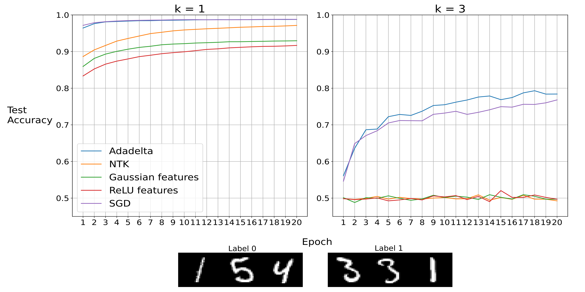

---
#########################################
# options for knitting a single chapter #
#########################################
output:
  bookdown::pdf_document2:
    template: templates/brief_template.tex
    citation_package: biblatex
  bookdown::html_document2: default
  bookdown::word_document2: default
documentclass: book
bibliography: [bibliography/references.bib, bibliography/additional-references.bib]
---

# Learning Problems {#chap:chapter_2}
\minitoc <!-- this will include a mini table of contents-->

<!-- LaTeX normally does not indent the first line after a heading - however, it does so after the mini table of contents. You can manually tell it not to with \noindent -->

\noindent The success of neural networks spawned a great interest in the field of learnability of the various models. This involves testing different models on the same problem, usually difficult to learn, and observing the results. It is particularly beneficial to understand the learning dynamics of the models, which helps to find out their limitations. These studies achieved striking success in understanding neural networks.

## Parity Learning Problem
In \cite{DBLP:journals/corr/abs-2002-07400}, authors questioned how far neural networks could go beyond the linear models. They did this by focusing on parities that have a complex family of target functions. They demonstrated that this family could be approximated by a two-layer network trained with Adadelta but not by lazy methods. This study brings an explanation of why neural networks' performance is better than linear methods, and it proves neural networks' learning capacities are beyond lazy methods.\
Experiments are performed on the MNIST dataset by imitating the parity problem. The task is: given a parameter k (defines the number of digits to be stacked together that is chosen uniformly from the dataset), determine if the sum of the digits is odd or even. When $k=1$, it is a simplified version of the standard MNIST task to find if a digit is even or odd. Experiment results showed that all models, including the lazy ones, reached a similar performance in the $k=1$ case where the neural network slightly outperformed others. On the other hand, the problem becomes more difficult for the case $k=3$ because models need to compute the parity of the digits' sum. In this case, there is a drastic gap between the neural network and lazy methods. Because the predictions of lazy methods did not go beyond the random guess.\
Since our goal is comparing DFA and BP on this particular problem, reproducing the results from \cite{DBLP:journals/corr/abs-2002-07400} is unavoidable. The same configurations are used with minor differences and, they are implemented in Pytorch \cite{NEURIPS2019_9015}. The network has only a hidden layer with $512$ neurons. For the last layer, sigmoid is used as a non-linear activation function. For the hidden layer, reLU is used. BCE is preferred as a loss function, and $10^{-3}$ is set to weight decay. In addition to previous settings, we have also used SGD to observe how much Adadelta improves. For the case $k=3$, we performed a simple hyper-parameter tuning process to get a decent learning rate for each method. Same learning rate values are used for the case $k=1$. The hyperparameter tuning process is the following. First, we define the parameter space, later we run with all different learning rates, and we compare these runs by the average of test accuracy of the last ten epochs, and we choose the highest one. It is also crucial to mention that, at each epoch, train data is recreated to boost the available data for the models. The same is also performed for test data to have an unbiased estimation of test accuracy. It increases the available data because the creation of the data is stochastic. The process is the following: random images are sampled uniformly from the available dataset, then according to given parameter $k$, these random images are horizontally stacked. Hence we have different dataset at each epoch that helps networks to learn and perform better. Finally, these images are normalized before training the networks, which is necessary for deep learning tasks. 
```{r MNISTparity, fig.cap="Reproduced Parity Experiment \\cite{DBLP:journals/corr/abs-2002-07400}", fig.align='center', out.width='100%', echo=FALSE}

```
\noindent The reproduced result can be observed in figure \ref{fig:MNISTparity}. Similar to results from \cite{DBLP:journals/corr/abs-2002-07400}, all the methods succeed learning for $k=1$ case. However, adadelta and SGD slightly outperformed lazy methods in this setting. In the case of $k=3$, adadelta and SGD almost reach $80\%$, but the performance of lazy methods does not go beyond a random guess.\ 
After having the concrete picture from the previous study, it is intriguing to see how DFA would perform with SGD and adaptive methods on this particular problem. We will investigate it in chapter \ref{chap:chapter_3} with other experiments.

## Random Data Problem
In \cite{chizat2020implicit}, the authors presented implicit bias in two-layer neural networks with cross-entropy loss trained with SGD. The study is beneficial to observe this phenomenon of gradient methods and training dynamics of wide neural networks. After demonstrating theoretical results, they performed numerical experiments to validate these results. For the numerical experiments, there is a binary classification problem, and the data is randomly generated. The number of samples and dimensions can be adjusted in the dataset. Similar to parity experiments, the results demonstrated the superiority of the neural network to the lazy method. Considering that all the nice properties of the dataset and the similarity of our previous comparison, it is an excellent problem to compare BP and DFA. Besides, it is nicer to compare BP and DFA in another challenging problem which the difficulty of it can be adjusted to avoid limiting our experiments with only the parity problem.\
\noindent Given the parameter $c$ that denotes the number of clusters (in \cite{chizat2020implicit}, this parameter is denoted as $k$ since we used the same notation in parity problem, to avoid any confusion it is changed). The data is generated as the following: in dimension $d=2$, the distribution of the input values is a mixture of $c^2$ uniform distributions on the disk of radius $1/ (3c-1)$ on a uniform two-dimensional grid with step $3/(3c-1)$. Larger dimensions follow the uniform distribution  on $[-1/2,1/2]$. Each cluster is assigned randomly to a label \cite{chizat2020implicit}. In other words, after having the cluster centers, each input is sampled by following the uniform distribution with the shift angle and magnitude for dimension $2$. For other spurious dimensions, each input value is sampled from a uniform distribution. Unlike the paper, labels are $0,1$, not $-1,1$ because it fits the structure of our previous architecture and training mechanism that is used for the parity experiment.\
Like the parity problem, before testing DFA on the problem, it is beneficial to reproduce results from the previous study. For this purpose, the scratch implementation is used with the same architecture (only a hidden layer, $1000$ layer size, with reLU and sigmoid non-linearities). For each $n$ (number of training samples) and $d$ (number of dimensions, $\geq2$), experiments were performed three times, and they are plotted with a $95\%$ confidence interval. At each repetition, data is recreated to have a better estimation of test error. Similar to paper, the learning rate is set to $0.5$ (no hyperparameter tuning process is performed for this problem), weight decay is not used, and the epoch number is $500$. With this high epoch number, we give enough time for all methods to converge.
```{r randomData, fig.cap="Reproduced Random Data Experiment \\cite{chizat2020implicit}", fig.align='center', out.width='100%', echo=FALSE}
knitr::include_graphics("figures/2_randomData_reproduced.png")
```
\noindent We can observe the reproduced experiment results in \ref{fig:randomData} from \cite{chizat2020implicit}. On the left, we have the data distribution in two-dimension with $c=3$, so we have 9 clusters, and their labels are assigned randomly. In the middle plot, we have the test error and an increasing number of training samples where number of dimension is $15$. Normally we expect to see reducing test error with the increasing number of training samples for each model. On the right, we have the test error and the number of dimensions where number of samples are $256$. The problem becomes challenging with the increasing number of dimensions because extracting useful information becomes more difficult for models with higher dimensional input. Therefore we see the increasing test error. Labels from the plot are named the following: Training Method (BP or DFA) + Optimizer + Both layers are trained (True or False). Similar to the paper results, we observe that training both layers gives better results than training only the output layer. In other words, increasing the number of training samples helps more to network than the lazy method, and the neural network is more successful in distinguishing useful inputs in high dimensions for this problem. It is interesting to put DFA in this frame to observe if it is closer to the lazy method or BP. It is also intriguing to try to close the gap between them if there is any.\
After having the reproduced results for the random data problem, we completed the chapter on learning problems.  First, we started explaining the problems, and we described how they are generated and the task. Then we explained the details of the architecture, hyperparameter tuning, and training phase used in experiments. We presented the reproduced results from the papers and motivated the testing DFA on these problems.