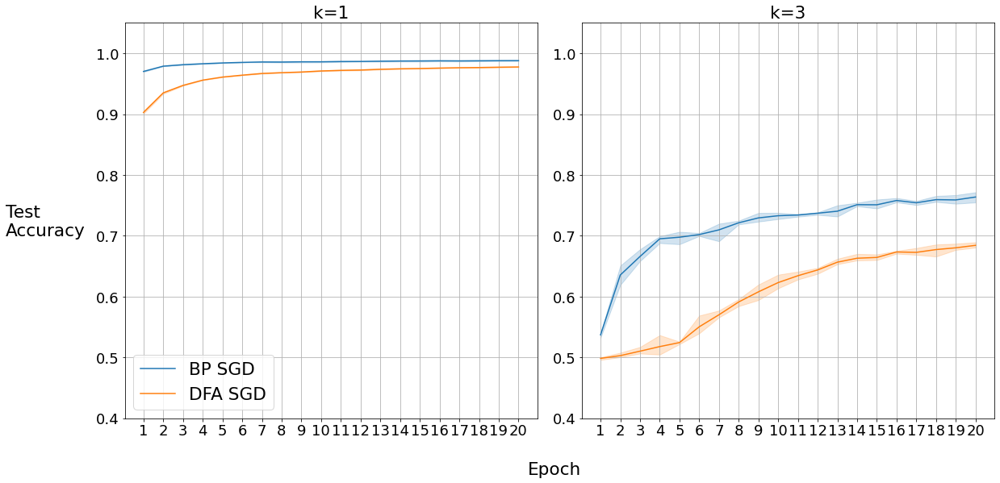
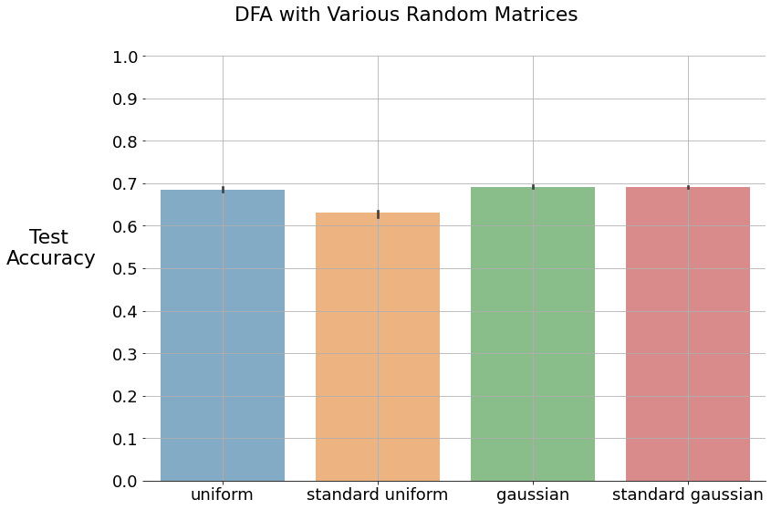

---
output:
  #bookdown::html_document2: default
  #bookdown::word_document2: default
  bookdown::pdf_document2:
    template: templates/brief_template.tex
    citation_package: biblatex
bib-humanities: true
documentclass: book
bibliography: [bibliography/references.bib, bibliography/additional-references.bib]
---

# Experiments {#chap:chapter_3}
\minitoc 
\noindent After having the previous study results, we can continue to test DFA on the parity learning problem. Train phase and the hyperparameter tuning process are explained in chapter \ref{chap:chapter_2}. These processes are the same for the following experiments. For all experiments, scratch implementations are used with minimal Pytorch functionalities. They are performed three times and plotted with their mean and standard deviation or with their confidence interval.\
The same architectures are used as the previous study for BP and DFA, meaning that we have only a hidden layer with 512 neurons, and reLU is used as a non-linear function for the hidden layer. BCE is chosen as a loss function and, sigmoid is preferred for the non-linearity of the last layer. Networks are trained for twenty epochs unless others are specified, and at each epoch, train and test datasets are recreated as it is explained in chapter \ref{chap:chapter_2}. Weights of the networks are initialized uniformly with $\frac{1}{\sqrt{input dim}}$ as in default Pytorch weight initialization. Moreover, the random matrix $B$ is initialized with the same way to have similar behaviors as the weight matrix unless other specified.

## Parity Learning Experiments
Since the experiment details are clear now, it is time to test DFA on parity learning problem with BP by using SGD.
```{r BPvsDFA, fig.cap="BP and DFA on Parity Problem with SGD", fig.align='center', out.width='100%', echo=FALSE}

```
\noindent We can observe the results in \ref{fig:BPvsDFA} with $95\%$ confidence interval. In the case $k=1$, although DFA outperforms the lazy methods, it is behind the BP. In the case $k=3$, it is obvious that DFA performs much better than lazy methods. However, the gap between BP and DFA is a bit higher than $k=1$ case. It seems like there is a limit for DFA to reach with SGD that is $\%70$. The reason is that DFA has an additional task to accomplish, which is aligning with BP's teaching signals. In other words, the network loses time while trying to make teaching signals useful. This delays the convergence and causes performance lag. We can see that during the first iterations, DFA does not converge fast enough to catch up with BP, and it always stays behind the BP.\
The thrilling question is, is there a performance limit for DFA to reach, and can we get similar performance as BP by making some changes? For answering the first question, it is better to run DFA for more epochs to see if it can reach a similar performance as BP. Because with longer training, DFA will have time to align and converge. It would be convenient to test DFA with different random matrices to observe any improvement for the second question. Because it is clear that learning in DFA is strongly dependent on random matrix. Besides, it is interesting to test if DFA can learn with a different types of random matrices. During the learning rate phase of DFA, we noticed that it is susceptible to the learning rate. Having a small learning rate caused no convergence, and larger learning rates showed over-fitting within specified epoch numbers. Therefore we can use adaptive methods to have better convergence properties both in BP and DFA. These methods are specifically good at adjusting the learning rate, which is more difficult to tune for DFA than BP.\
\noindent We trained DFA for 50 epochs with a tuned learning rate to observe if it can reach a similar performance as BP. At the same time, alignment between the random matrix and the transpose of the weight matrix is plotted. This alignment is measured by using the cosine similarity.
```{r DFA50epochs, fig.cap="DFA on Parity Problem with Alignment", fig.align='center', out.width='100%', echo=FALSE}
knitr::include_graphics("figures/3_k3_SGD_DFA_Alingment.png")
```
\noindent From figure \ref{fig:DFA50epochs}, we can see that DFA can reach a similar performance as BP trained with SGD. This result approves our comments about the additional task DFA has and why it takes longer to achieve the same performance. On the right side of the plot, we can examine the alignment between the random matrix and the transpose of the weight matrix. At the beginning of training, the similarity is low. However, with advancing steps, we can see that alignment becomes higher, similar to the performance. It shows that the network aligns with the BP's teaching signals. In other words, the network learns how to learn by using the random matrix.
\noindent After having a similar performance from DFA with SGD, it is intriguing to test if we can achieve similar performance within the same epoch number. For this purpose, the first improvement attempt will be related to random matrices. Using different random matrices may influence the performance of DFA. Some of them might align better with BP's teaching signals. On the other hand, it is interesting to observe if we can learn with any random matrix.\
Among uniform random matrix, three different random matrices are tested. They are initialized as the following: \textbf{standard uniform} is default Pytorch initialization that is uniformly distributed from $0$ to $1$. \textbf{Gaussian} is initialized normally with $\mu$ and $\sigma$ are equal to each other that is $\frac{1}{\sqrt{input dim}}$. Lastly, \textbf{standard gaussian} is initialized with $\mu=0$ and $\sigma=1$.
```{r DFARandomMatrices, fig.cap="DFA on Parity Problem with Various Random Matrices", fig.align='center', out.width='100%', echo=FALSE}

```
\noindent From figure \ref{fig:DFARandomMatrices}, we can observe that DFA can learn with any random matrices. However, it is essential to specify that learning rates for each random matrix are tuned and drastically different. Apart from standard uniform, the rest of the random matrices achieved similar performances, but they are still behind the BP. However, thanks to these results, we can see that DFA is highly sensitive to the learning rate. Because during the tuning phase, small learning rates did not converge within the specified epoch number. On the other hand, high learning rates demonstrated overfitting. Therefore, since adaptive methods have better convergence properties, they may increase the performance of DFA as they did in BP. For the rest of the DFA experiments, the random matrix is uniformly initialized since there is no significant improvement with other initializations.\
\noindent Following the previous deduction, various adaptive methods are tested on the parity learning problem for BP and DFA. Their learning rates are tuned, as it is explained in the previous chapter. For the experiments, they are run three times, and their final test accuracies are plotted. The results are presented in figure \ref{fig:mainExperiment}.
```{r mainExperiment, fig.cap="DFA and BP on Parity Problem with Adaptive Methods", fig.align='center', out.width='100%', echo=FALSE}
knitr::include_graphics("figures/3_mainExperiment.png")
```
\noindent As expected, adaptive methods improve the final test accuracy significantly for both BP and DFA. On average, DFA is still behind the BP, but with RMSProp and Adadelta, the gap is much smaller than with plain SGD, sometimes DFA's final test accuracy even exceeds BP. In other words, we can say that some adaptive methods help DFA more than BP. However, we should not ignore that DFA has larger fluctuations for the final test accuracy than BP. With the last experiment, we could close the gap between BP and DFA on the parity learning problem thanks to adaptive methods.

## Random Data Experiments
TODO: Report the random data experiments under this subtitle.
