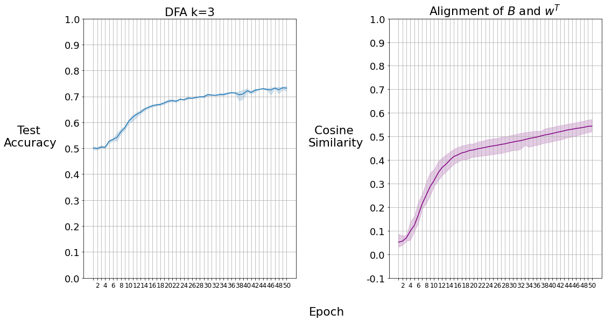
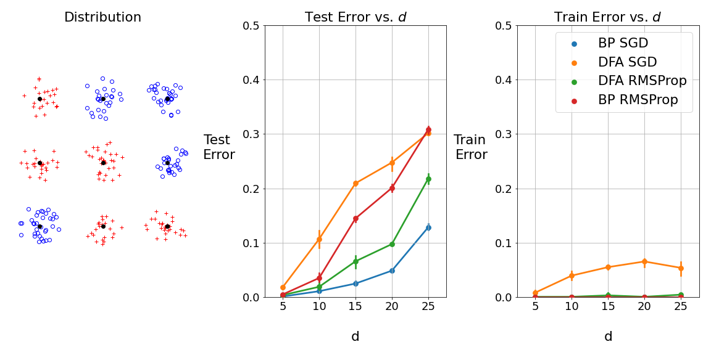

---
#########################################
# options for knitting a single chapter #
#########################################
output:
  bookdown::pdf_document2:
    template: templates/brief_template.tex
    citation_package: biblatex
  bookdown::html_document2: default
  bookdown::word_document2: default
documentclass: book
bibliography: [bibliography/references.bib, bibliography/additional-references.bib]
---

# Experiments {#chap:chapter_3}

\noindent After having the previous study results, we can continue to test DFA on the learning problems. Train phase and the hyperparameter tuning process are explained in chapter \ref{chap:chapter_2}. These processes are the same for the following experiments. For all experiments, scratch implementations are used with minimal Pytorch functionalities. They are performed three times and plotted with their confidence interval.\
The same architectures are used for BP and DFA, meaning that we have only a hidden layer with 512 neurons for both problems, reLU is used as a non-linear function for the hidden layer, and sigmoid is preferred for the non-linearity of the last layer. BCE is chosen as a loss function. Weights of the networks are initialized uniformly with $\frac{1}{\sqrt{input dim}}$ as in default Pytorch weight initialization.  Moreover, the random matrix $B$ is initialized with the same way to have similar behaviors as the weight matrix unless other specified. For the parity problem, networks are trained for 20 epochs unless others are specified, and at each epoch, train and test datasets are recreated as it is explained in chapter \ref{chap:chapter_2} whereas, for the synthetic data problem, networks are trained for 500 epochs.

## Parity Learning Experiments
For each experiment, when there is a change in the training method (DFA or BP) or optimization method, hyperparameter tuning is performed to obtain a decent learning rate. Weight decay is not used for the experiments. Since the experiment details are precise, we can test DFA on the parity learning problem with BP using SGD.
```{r BPvsDFA, fig.scap="BP and DFA on MNIST-Parity Problem with SGD", fig.cap=" \\textbf{BP and DFA on MNIST-Parity Problem with SGD} \\newline The predictive power of DFA is presented on the MNIST-Parity experiment among BP. The left is the test accuracy for the parity of a single image. The right is the test accuracy for the parity of three images." , fig.align='center', out.width='100%', echo=FALSE}
knitr::include_graphics("figures/3_k13_SGD_DFAvsBP.png")
```
\noindent We can observe the results in figure \ref{fig:BPvsDFA} with $95\%$ confidence interval. In the case $k=1$ (parity of a single image), DFA outperforms the lazy methods, but it is behind the BP. In the case $k=3$ (parity of the sum of three digits), it is obvious that DFA performs much better than lazy methods. However, the gap between BP and DFA is a bit higher than the $k=1$ case. It seems like there is a limit for DFA to reach with SGD that is around $\%70$. The reason is that DFA has an additional task to accomplish, which is aligning with BP's teaching signals. In other words, the network loses time while making teaching signals useful. This delays the convergence and causes performance lag. We can see that during the first iterations, DFA does not converge fast enough to catch up with BP, and it always stays behind it.\
The thrilling question is, is there a performance limit for DFA to reach, and can we get a similar performance as BP by making some changes? For answering the first question, it is better to run DFA for more epochs to see if it can reach a similar performance as BP. Because with longer training, DFA will have time to align and converge. Also, it would be convenient to test DFA with different random matrices to observe any improvement for the second question. Because it is clear that learning in DFA is strongly dependent on random matrix. Besides, it is interesting to test if DFA can learn with different random matrices. While tuning the learning rate for DFA, we noticed that it is susceptible to the learning rate. Therefore we can use adaptive methods to have better convergence properties in BP and DFA. These methods are specifically good at adjusting the learning rate, which is more difficult to tune for DFA than BP.\
\noindent Given that, we trained DFA for 50 epochs with a tuned learning rate to observe if it can reach a similar performance as BP. At the same time, alignment between the random matrix and the transpose of the weight matrix is plotted. This alignment is measured by using the cosine similarity.
```{r DFA50epochs, fig.scap="DFA on MNIST-Parity Problem with Alignment", fig.cap="\\textbf{DFA on MNIST-Parity Problem with Alignment} \\newline DFA on MNIST-Parity task for the case $k=3$ trained $50$ epochs. The left is the test accuracy of DFA, and the right is the cosine similarity of the random matrix and the transpose of the weight matrix.", fig.align='center', out.width='100%', echo=FALSE}

```
\noindent From figure \ref{fig:DFA50epochs}, we can see that DFA can reach a similar performance as BP trained with SGD. This result approves our comments about the additional task DFA has and why it takes longer to achieve the same performance. On the right side of the plot, we can examine the alignment between the random matrix and the transpose of the weight matrix. At the beginning of training, the similarity is low. However, we can see that alignment increases, similar to the performance with advancing steps. It shows that the network aligns with the BP's teaching signals. In other words, the network learns how to learn by using the random matrix.
\noindent After having a similar performance from DFA with SGD, it is intriguing to test if we can achieve similar performance within the same epoch number. For this purpose, the first improvement attempt will be related to random matrices. Using different random matrices may influence the performance of DFA. Some of them might align better with BP's teaching signals. On the other hand, it is interesting to observe if we can learn with any random matrix.\
Apart from uniform random matrix, three different random matrices are tested. They are initialized as the following: \textbf{standard uniform} is default Pytorch initialization that is uniformly distributed from $0$ to $1$. \textbf{Gaussian} is initialized normally with $\mu$ and $\sigma$ are equal to each other that is $\frac{1}{\sqrt{input dim}}$. Lastly, \textbf{standard gaussian} is initialized with $\mu=0$ and $\sigma=1$.
```{r DFARandomMatrices, fig.scap="DFA on MNIST-Parity Problem with Various Random Matrices", fig.cap="\\textbf{DFA on Parity Problem with Various Random Matrices} \\newline The final test accuracy of DFA on the MNIST-Parity for the case $k=3$. The experiments performed three times and plotted with $95\\%$ confidence interval. The random matrices are initialized as the following: $\\text{standard uniform} \\sim U(0,1)$, $\\text{uniform} \\sim U(-a,+a)$, $\\text{standard gaussian} \\sim \\mathcal{N}\\left(0, 1\\right)$ and $\\text{gaussian} \\sim \\mathcal{N}\\left(a, a \\right)$ where $a= \\frac{1}{\\sqrt{input dim}}$.", fig.align='center', out.width='100%', echo=FALSE}
knitr::include_graphics("figures/3_k3_DFA_RandomMatrices.png")
```
\noindent From figure \ref{fig:DFARandomMatrices}, we can observe that DFA can learn with any random matrices. However, it is essential to specify that learning rates for each random matrix are tuned and drastically different. Apart from standard uniform, the rest of the random matrices achieved similar performances, but they are still behind the BP. However, thanks to these results, we can see that DFA is highly sensitive to the learning rate. Because during the tuning phase, small learning rates did not converge within the specified epoch number. On the other hand, high learning rates demonstrated overfitting for each random matrices. Interested readers may refer to appendix \ref{chap:appendix_b} for more details on this argument. Therefore, since adaptive methods have better convergence properties, they may increase the performance of DFA as they did in BP. For the rest of the DFA experiments, the random matrix is uniformly initialized since there is no significant improvement with other initializations.\
\noindent Following the previous deduction, various adaptive methods are tested on the parity learning problem for BP and DFA. Their learning rates are tuned, as explained in the previous chapter. For the experiments, they are run three times, and their final test accuracies are plotted. The results are presented in figure \ref{fig:mainExperiment}.
```{r mainExperiment, fig.scap="DFA and BP on MNIST-Parity Problem with Adaptive Methods", fig.cap="\\textbf{DFA and BP on MNIST-Parity Problem with Adaptive Methods} \\newline The final test accuracies are presented for BP and DFA with adaptive optimization algorithms. The experiments were performed three times and plotted with a $95\\%$ confidence interval.", fig.align='center', out.width='100%', echo=FALSE}
knitr::include_graphics("figures/3_mainExperiment.png")
```
\noindent As expected, adaptive methods improve the final test accuracy significantly for both BP and DFA. On average, DFA is still behind the BP, but with RMSProp and Adadelta, the gap is much smaller than with plain SGD. Sometimes DFA's final test accuracy even exceeds BP. In other words, we can say that some adaptive methods help DFA more than BP on this task. However, we should not ignore that DFA has larger fluctuations for the final test accuracy than BP. Thanks to adaptive methods, the last experiment could close the gap between BP and DFA for the parity learning problem.
\noindent The reason for the improvement of adaptive methods in DFA is an excellent question to investigate the algorithm's behavior. One possible idea is, adaptive methods may spawn better alignment than SGD. Testing this theory is relatively easy. We can train DFA with SGD and one of the adaptive methods, and then we can observe the alignment of the random matrix and the transpose of the weight matrix with gradient alignments.
```{r Alignment, fig.scap="Alignment Comparison of SGD and RMSProp", fig.cap="\\textbf{Alignment Comparison of SGD and RMSProp} \\newline The top is the alignment of the random matrix and the transpose of the weight matrix for SGD and RMSProp. The bottom is the alignment of the gradients of $w_1$ concerning loss for SGD and RMSProp. Both plots are trained on the MNIST-Parity task for the case $k=3$ for $50$ epochs." ,fig.align='center', out.width='100%', echo=FALSE}
knitr::include_graphics("figures/3_k3_SGD_RMSProp_DFA_Alingment.png")
```
\noindent In figure \ref{fig:Alignment}, we can see the alignment measures of SGD and RMSProp. It is interesting to point out that SGD has better alignment during the later training steps than RMSProp. From the results of the previous experiments, we know that RMSProp performed better than SGD on this task. Given that, for having better performance, perfect alignment is not always required. On the other hand, at the beginning of the training, RMSProp aligns faster than SGD. Therefore, we can say that there is a faster alignment with adaptive methods at the beginning that prevents DFA from losing time at first epoch numbers, but later DFA finds other paths to find the minimum that is different from BP. These outcomes are parallel to results of \cite{refinetti2021align}, it was stated that DFA first aligns with BP, and later it sacrifices from this alignment to find better paths to the minimum. Apparently, this phenomenon happens quicker with adaptive methods than plain SGD. This part can be investigated in more detail to understand better the effect of adaptive methods on DFA. It is left for further studies.\
\noindent One of the exciting questions that are not directly related to the predictive power of the algorithms: do the networks learn the digits individually when we train them for the MNIST-Parity task and make the necessary processes (summation, division as humans), if not what type of information does it capture? We can answer this question by observing the hidden representation of the digits. If the network learns the digits well, we need to observe a good separation like the standard MNIST task (classifying hand digits). For this purpose, hidden representations of the digits from the networks trained with BP and DFA are plotted in two-dimensional space by using t-SNE using the implementation of sklearn \cite{scikit-learn}.\
The hidden representation of a single image in the $k=3$ case is obtained in the following way; we know that after we flatten the images, particular parts of each image are multiplied by corresponding parts of the weight matrix. Getting these parts and performing multiplication for each digit will reveal the hidden representation of the individual digit trained in the $k=3$ case. Process is visualized in figure \ref{fig:HiddenRepProcess}. After extracting the pixels of each image and the corresponding weights, we end up with the following matrix multiplication: $[\text{Batch Size} \times 784] [784 \space \times \space \text{Hidden Layer}]$ where $784$ is $28 \times 28$ and $28$ is the pixel size of a single digit. With this matrix multiplication, we have the hidden representation of each image. 
```{r HiddenRepProcess, fig.scap="Process of Extracting the Hidden Representation of Single Digit", fig.cap="\\textbf{Process of Extracting the Hidden Representation of Single Digit} \\newline After extracting the digits and the corresponding weights, the matrix multiplication (same color) for each digit is performed separately ($28$ is the pixel size of a single digit); by doing so, we have the hidden representation of a single image from the network trained for parities of the sum of three digits.", fig.align='center', out.width='100%', echo=FALSE} 

```
\noindent After performing the matrix multiplication, the rest is visualizing these hidden representations by using the t-SNE. Since the t-SNE is computationally expensive, only 7500 random samples are plotted from the dataset. In figure \ref{fig:tSNEBPDFA} we can observe the results in two dimensions and say that the networks do not capture the information about the digits individually when they are trained for parities of the sum of three digits. They learn different properties of the data, not the digits individually. However, for the same purpose, transfer learning can be implemented to test if these networks trained for the parity problem can classify the digits accurately. Transfer learning is a method that involves storing the information gained while solving a problem and using this information on a different, but related problem \cite{DBLP:journals/corr/JhaS15}. Also, the same experiment can be performed for deeper networks. Maybe deeper representations of the parities might contain information about the digits individually. These experiments are left for future studies. On the other hand, it is not surprising that BP and DFA capture very similar information from the MNIST-Parity dataset.
```{r tSNEBPDFA, fig.scap="Hidden Representation of Digits in BP and DFA", fig.cap="\\textbf{Hidden Representation of Digits in BP and DFA} \\newline Hidden representations of images are visualized with their labels for BP and DFA. The process of acquiring these representations is explained in figure \\ref{fig:HiddenRepProcess}.", fig.align='center', out.width='100%', echo=FALSE}

```

## Synthetic Data Experiments
After having the previous experiment result and current experiments details for synthetic data, we can test the DFA on the number of dimensions plots with the train and test error to compare with BP. Most of the parameters are the same as MNIST-Parity experiments. The only difference is the learning rate. The learning rate is set to $0.5$ without hyperparameter tuning for all methods. They are performed with three repetitions and plotted with their $95\%$ confidence interval.
```{r DFARandom, fig.scap="BP and DFA on Synthetic Data Problem", fig.cap="\\textbf{BP and DFA on Synthetic Data Problem} \\newline On the left, the input distribution of the two first dimensions is used for the experiment. In the middle and on the right, test and train error of BP and DFA with SGD and RMSProp as a function of the number of dimensions ($d$) where the number of inputs is $256$ ($n = 256$)." ,fig.align='center', out.width='100%', echo=FALSE}

```
\noindent Before interpreting the results, it is essential to mention that experiment results will be drastically different if the input distribution has changed. We have chosen a distribution that shows the difference among the algorithms well. It would be more convenient to run for different datasets with more repetition and plot the average. We left this for future considerations.
\noindent We can observe the results in figure \ref{fig:DFARandom}. Although DFA with SGD cannot fit data well (train error is not $0$ like others), it has a better test error than the lazy method. However, BP with SGD outperforms the other methods. Since it is natural to try adaptive methods to hope for an improvement, as we experienced for the parity experiments, we used RMSProp on the same problem both for BP and DFA. It again increases the convergence (train error is $0$) and improves the test error of the DFA, but it is still behind the BP with SGD.\
\noindent It is also interesting that BP with RMSprop did not perform better than plain BP with SGD. It might be due to the implicit bias of adaptive methods (while fitting the data, the adaptive methods might choose global minima of the training loss with suboptimal generalization error), or sometimes adaptive methods can have unexpected problems in simple settings, such as convex problems (this distribution might be another example of this) \cite{reddi2019convergence}. Furthermore, there are some interesting results similar to our findings that show; although adaptive methods fit the train data well, they may generalize poorly, so these results are thus less surprising for BP \cite{wilson2018marginal}. Because both our setup and the setup of \cite{wilson2018marginal} have in common that the label of the data point depends only on a very low-dimensional subspace of input space, which could explain the similar trends observed for adaptive BP methods. The interesting observation is the opposite effect for DFA. Understanding why adaptive methods affect BP and DFA differently is an intriguing avenue for further works.\
\noindent Moreover, it is promising that DFA improves with one of the adaptive methods for another challenging learning problem. We have to specify that, It would be intriguing to observe well-tuned DFA with different adaptive methods on the same problem; this is again left for future investigations.\

\noindent \textbf{Highlights} \
With the synthetic data experiment, we conclude the experiments. We started with testing the predictive power of DFA on the MNIST-Parity task. Then, we visualized the alignment of the random matrix and the transpose of the weights matrix. After that, we tried to improve the performance of DFA by trying different types of random matrices and adaptive methods. We discovered that with the help of adaptive methods, DFA could perform as well as BP within the same epoch numbers. For investigating why adaptive methods help DFA more than BP, we compared the alignments of SGD and RMSProp for DFA. We concluded that better alignment does not always mean better performance. Detailed investigation of this observation is left for future studies. Then, we visualized the hidden representations of the digits from the network trained for the MNIST-Parity task. We observed that networks do not capture information about the digits individually. Lastly, we performed the synthetic data experiment using a fixed distribution. We plotted the final train and test error of BP and DFA, both with SGD and RMSProp as the function of the number of dimensions. Once again, we noticed that adaptive methods boost the performance of DFA. We left some further experiments of synthetic data for future studies.